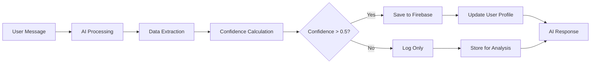

# RT1M AI Integration Endpoints

This document describes the new Firebase Cloud Functions designed to integrate your RT1M chatbot with the user database for seamless data extraction and storage.

## 🚀 Overview

The AI integration endpoints allow your chatbot to:
- **Extract structured data** from conversations (personal info, financial data, goals, skills)
- **Intelligently merge** AI-extracted data with existing user data
- **Maintain data integrity** with confidence scoring and validation
- **Log conversations** for analytics and improvement
- **Provide context** to the AI for more personalized responses

## 📋 Available Endpoints

### 1. `updateUserDataFromAI`
**Purpose**: Bulk update user data from AI-extracted conversation data

**Parameters**:
```javascript
{
  personalInfo?: {
    name?: string,
    age?: number,
    email?: string,
    location?: string,
    occupation?: string,
    employmentStatus?: string,
    country?: string
  },
  financialInfo?: {
    annualIncome?: number,
    annualExpenses?: number,
    currentSavings?: number,
    totalAssets?: number,
    totalDebts?: number
  },
  goals?: Array<{
    title: string,
    category?: string,
    status?: string,
    description?: string,
    data?: {
      targetAmount?: number,
      currentAmount?: number,
      targetDate?: string,
      progress?: number
    }
  }>,
  source?: string // Default: "ai_chat"
}
```

**Features**:
- Merges data with existing user information
- Prevents duplicate goals using smart matching
- Adds AI metadata for tracking
- Validates data before saving

### 2. `mergeFinancialDataFromAI`
**Purpose**: Smart financial data merger with confidence-based updates

**Parameters**:
```javascript
{
  financialUpdates: {
    annualIncome?: number,
    annualExpenses?: number,
    currentSavings?: number,
    totalAssets?: number,
    totalDebts?: number
  },
  confidence?: number, // 0.0 - 1.0, default: 0.8
  source?: string
}
```

**Smart Logic**:
- Only updates fields if confidence ≥ 0.8 OR existing field is empty/zero
- Tracks confidence scores and AI sources for each field
- Preserves existing data when confidence is low

### 3. `updateSkillsFromAI`
**Purpose**: Add skills and interests from AI conversations

**Parameters**:
```javascript
{
  skills?: string[],
  interests?: string[],
  source?: string
}
```

**Features**:
- Automatically deduplicates skills and interests
- Case-insensitive matching
- Preserves existing data

### 4. `getAIConversationContext`
**Purpose**: Retrieve user data for AI context and personalization

**Returns**:
```javascript
{
  personalInfo: {...},
  financialGoal: {...},
  financialInfo: {...},
  currentGoals: [...],
  skills: [...],
  interests: [...],
  dataCompleteness: {
    hasBasicInfo: boolean,
    hasFinancialInfo: boolean,
    hasGoals: boolean,
    hasSkills: boolean
  }
}
```

### 5. `logAIConversation`
**Purpose**: Log conversations for analytics and AI improvement

**Parameters**:
```javascript
{
  userMessage: string,
  aiResponse: string,
  extractedData?: object,
  confidence?: number,
  sessionId?: string,
  timestamp?: string
}
```

## 🛠️ Integration Guide

### Step 1: Set up Authentication
```javascript
// Get user's Firebase ID token from your auth system
const userToken = await firebase.auth().currentUser.getIdToken();
```

### Step 2: Make API Calls
```javascript
const response = await fetch(`${FIREBASE_BASE_URL}/updateUserDataFromAI`, {
  method: 'POST',
  headers: {
    'Authorization': `Bearer ${userToken}`,
    'Content-Type': 'application/json'
  },
  body: JSON.stringify({
    data: {
      personalInfo: { name: "John Doe", age: 30 },
      financialInfo: { annualIncome: 75000 },
      goals: [{ title: "Save for house", category: "financial" }]
    }
  })
});
```

### Step 3: Handle Responses
```javascript
const result = await response.json();
if (result.success) {
  console.log('Data saved successfully:', result.updatedSections);
} else {
  console.error('Error:', result.error);
}
```

## 🔒 Security Features

- **Authentication Required**: All endpoints require valid Firebase ID tokens
- **User Isolation**: Data is automatically scoped to the authenticated user
- **Data Validation**: Input validation and sanitization
- **Rate Limiting**: Built-in Firebase rate limiting
- **Audit Trail**: All operations are logged with metadata

## 📊 Data Flow Example



## 🎯 Best Practices

### 1. Confidence Thresholds
- **High confidence (>0.8)**: Auto-save financial data
- **Medium confidence (0.5-0.8)**: Save personal info and goals
- **Low confidence (<0.5)**: Log only, don't save

### 2. Data Merging Strategy
```javascript
// Good: Preserve existing data, only fill gaps
const mergedData = {
  ...existingData,
  ...aiExtractedData.filter(field => 
    !existingData[field] || confidence > 0.8
  )
};
```

### 3. Error Handling
```javascript
try {
  const result = await updateUserDataFromAI(data);
  if (!result.success) {
    // Handle business logic errors
    console.warn('Data not saved:', result.message);
  }
} catch (error) {
  // Handle network/auth errors
  console.error('API Error:', error);
}
```

### 4. Session Management
```javascript
// Use consistent session IDs for conversation tracking
const sessionId = `session_${Date.now()}_${userId}`;
```

## 🔧 Utility Functions

The system includes helper functions in `utils/ai_helpers.js`:

- `transformAIDataToFirebaseSchema()`: Convert AI data to Firebase format
- `calculateDataConfidence()`: Smart confidence scoring
- `sanitizeAIData()`: Data cleaning and validation
- `generateAIMetadata()`: Consistent metadata generation

## 📈 Analytics & Monitoring

### Conversation Logs
All conversations are stored in:
```
/users/{userId}/ai_conversations/{conversationId}
```

### AI Metadata Tracking
Each AI update includes:
- `aiGenerated: true`
- `aiSource: "rt1m_chatbot"`
- `aiConfidence: 0.85`
- `aiTimestamp: "2024-01-15T10:30:00Z"`

### Performance Metrics
Monitor:
- Data extraction success rates
- Confidence score distributions
- User engagement improvements
- Data completeness over time

## 🚀 Next Steps

1. **Deploy the functions** to your Firebase project
2. **Update your chatbot** to use the new endpoints
3. **Test with sample conversations** using the provided examples
4. **Monitor analytics** to optimize confidence thresholds
5. **Iterate based on user feedback** and data quality

## 📞 Support

For questions or issues with the AI integration:
1. Check the Firebase Functions logs
2. Review the example integration code
3. Test with the provided utility functions
4. Monitor confidence scores and adjust thresholds as needed

---

**Ready to integrate?** Check out `examples/firebase_integration_example.py` for a complete implementation example! 